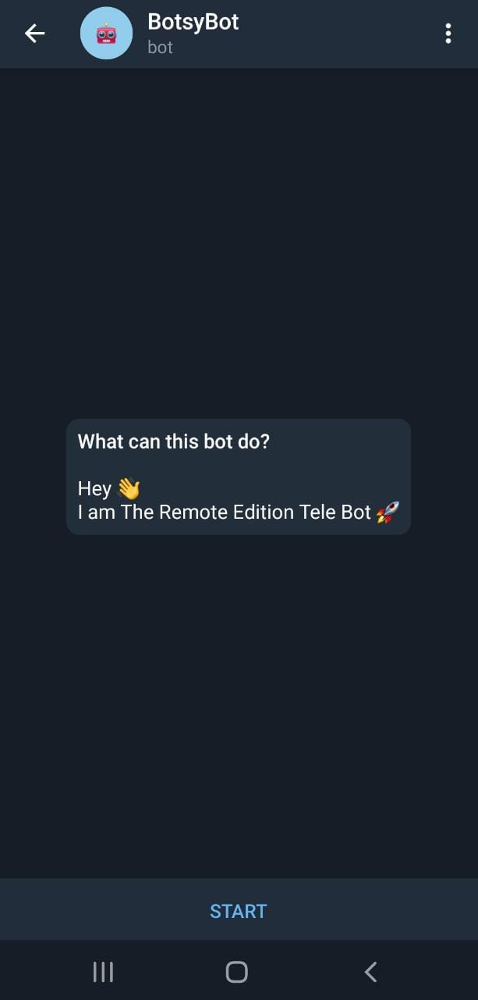
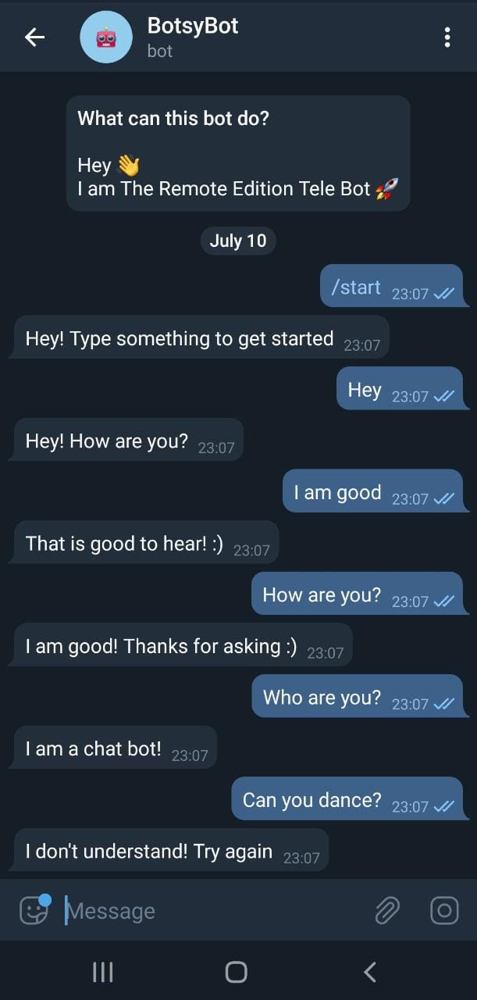

# BOTSY BOT
This is a telegram chatbot with an additional UI. The chatbot can be directly accessed from http://t.me/TheRemoteEditionTeleBot. 
This chatbot has been created using Python and it can be extended as per the needs. This chatbot can answer queries related to CRIO #IBD REMOTE WORKING TOOLS EDITION. 

### To run the file
- Clone the GitHub repository.
- Open PyCharm/Python editor.
- Open Python Project in the window.
- Open the terminal.
- Run ```pip install python-telegram-bot```
- Run the project.

### Command
To start the bot, after running the python script,
Enter ```/start```
This will enable your interaction.

### Features
This chatbot can answer queries related to CRIO #IBD REMOTE WORKING TOOLS EDITION. The chatbot can be extended as per the needs. 
- 'hello', 'hi', 'hey' 
- 'i am good', 'good'
- 'how are you', 'how are you?'
- 'what can you do', 'what can you do?'
- 'who are you', 'who are you?'
-  What is CRIO IBD Remote Working Tools Edition
-  What are the challenges?
-  Where should I submit my project?
-  What are the themes?
-  How should I submit my project?
-  What is in there for me?
-  What is the deadline?
-  I have more queries.

This bot converses when the python script is executed. It can reply to previous messages as well. 

### Project Images
        
        
      
### Demonstration Link
[Project Youtube link](https://youtu.be/eCnvboEd6mY)
This video is the demonstration link of the extendable bot

https://user-images.githubusercontent.com/71253790/125191393-d0ee9800-e25f-11eb-8f00-b44639eee1de.mp4
This video is the demonstration of support bot.

### To generalize the bot
- Automate the process of searching the event.
- Scrap the FAQ data from the events. 
- Update the response sheet.
- Voila

